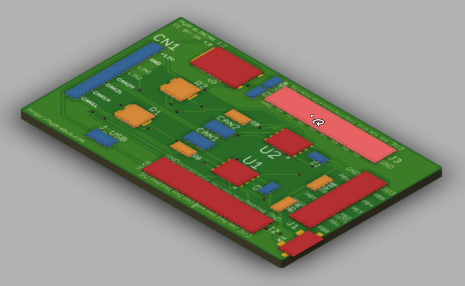
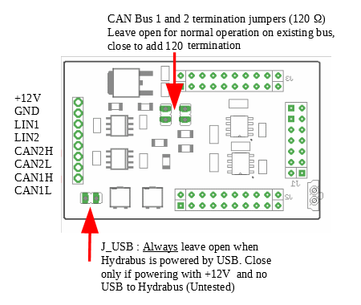

# HydraLINCAN shield for HydraBus

CAN and LIN Bus shield for Hydrabus http://hydrabus.com/
Refer to Hydrabus Wiki for more information on usage. https://github.com/hydrabus/hydrafw/wiki/HydraFW-CAN-guide

#### New version with cleaner and easier to read silkscreen.

Here is the wiring schema for HydraLINCAN.

