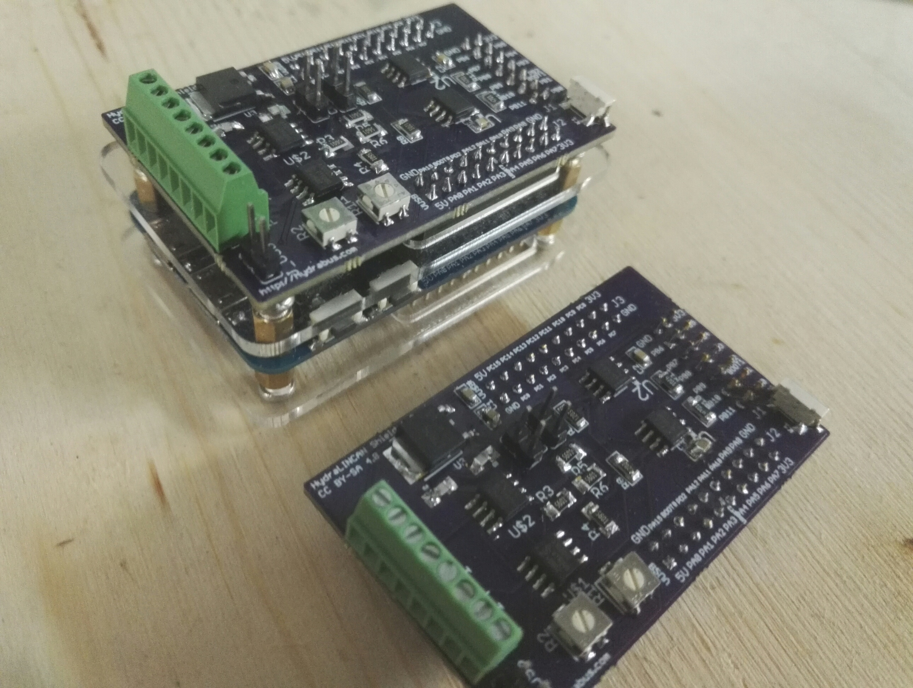

# HydraLINCAN Shield for HydraBus
# !Existing PCB contain an error: route between trimmers and +3V3 must be cut for CAN bus to work correctly! 
A few other corrections are still to come on the board.

CAN Bus and LIN Bus Shield for Hydrabus https://github.com/hydrabus/hydrafw

